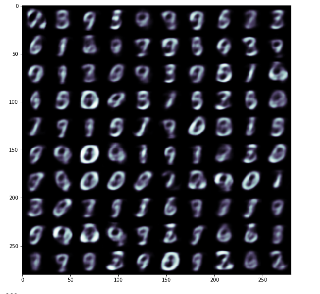
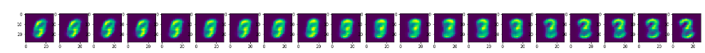
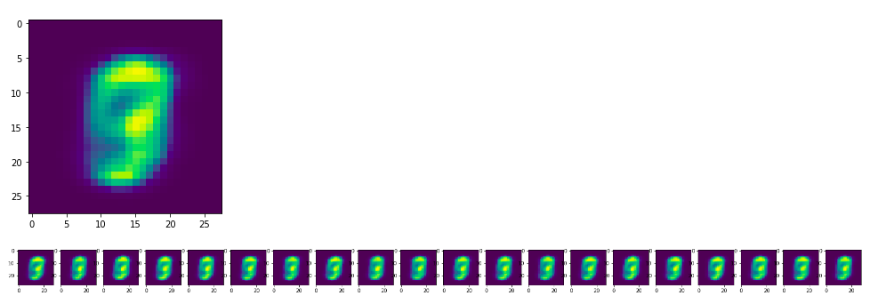
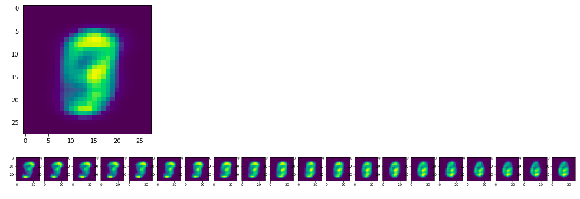
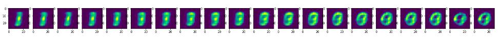

# Beta-VAE (Disentangled-VAE)

# Generative model outpu
## Number of latent space = 10
## Beta = 4

 

# Latent spaces
 

## Rotation

## Nothing at all (One of the perks of beta-VAE)

## Roundness

## Roundness
