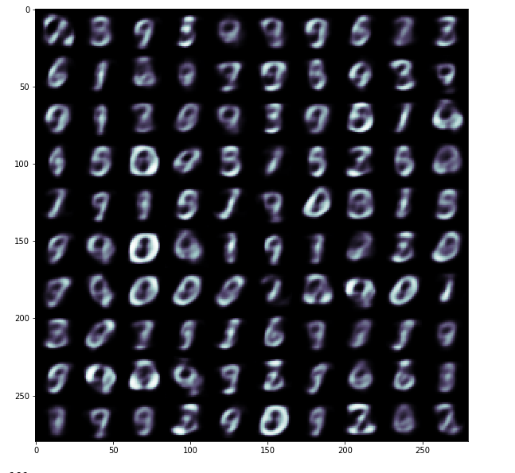

# Beta-VAE (Disentangled-VAE)

# Generative model outpu
## Number of latent space = 10
## Beta = 4

 

# Latent spaces Screenshot from 2019-12-26 16-58-13.png
 

## Roatation

## Nothing at all (One of the perks of beta-VAE)

## Roundness

## Roundness
